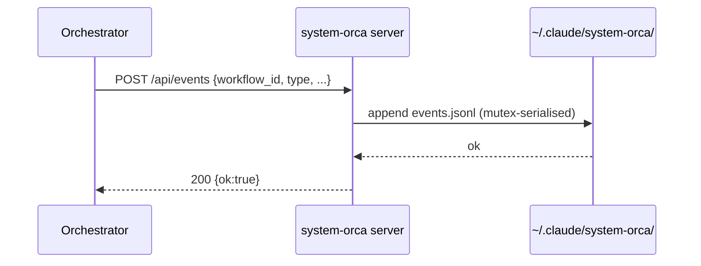

## Diagrams

<!-- PRIMARY comprehension surface. Reviewers should be able to grasp the full
change from the diagram(s) alone — Summary and code diff are supporting context,
not the primary explanation. Replace the example below with your own diagram(s).
Good shapes for system-orca: data flows (event → projection → endpoint),
sequence diagrams (orchestrator + subagent + server), state machines (stage
status), component trees (cards page), DAG topologies. Multiple diagrams are
encouraged when the PR spans layers. If the change genuinely cannot be
diagrammed (one-line typo, dep bump, comment-only), delete the block and
write: N/A — <reason> -->

## Summary

<!-- 1–3 bullets supporting the diagram(s) above. Lead with the *why* — the
diagram shows the *what*. -->

-
-

## Screenshots

<!-- REQUIRED when this PR adds or modifies visible UI (anything under
server/static/). Otherwise write "N/A — not UI".

Default workflow (human or subagent): simulate a paste into the GitHub PR
comment box to produce a persistent `user-attachments/assets/<uuid>` CDN URL.
The skill `pr-screenshots-via-user-attachments` encodes the full procedure,
the four tripwires, the permissions list, and a worked example — invoke it
before capturing screenshots.

Human-authored PRs can drag-and-drop an image directly into the comment box —
GitHub uploads it and inserts the same user-attachments link automatically. -->

## Test plan

<!-- Checklist of the verifications you ran. Reviewers expect all boxes
checked on a ready-to-merge PR. Mark items N/A if the PR doesn't touch the
relevant surface. -->

- [ ] `node --check server/server.js` — clean (if server changed)
- [ ] `node --check bin/system-orca` — clean (if CLI changed)
- [ ] `bin/system-orca up` followed by `down` — server lifecycle clean
- [ ] `node --test tests/` — green (Phase 2 onwards)
- [ ] Phase N verification gate from `docs/PLAN.md` (locally) — passed
- [ ] (UI only) chrome-devtools-mcp drive of the affected page — assertions
      pass at desktop (1440×900) and a smaller width; `list_console_messages`
      returns no errors/warnings
- [ ] No new npm dependencies introduced (`ls server/node_modules`,
      `cat package.json` should both fail / be absent)

## Plan reference

<!-- Link the issue this PR closes (or "Out of plan — <reason>"). Reference
the relevant SPEC.md section by anchor when the change implements a contract
defined there. PLAN.md is gitignored — refer to its phase number rather
than line numbers. -->

Closes #<issue> · Implements: SPEC.md §<section> · PLAN.md Phase <N>

---

🤖 Generated with [Claude Code](https://claude.com/claude-code)
